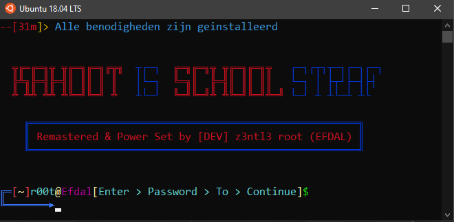
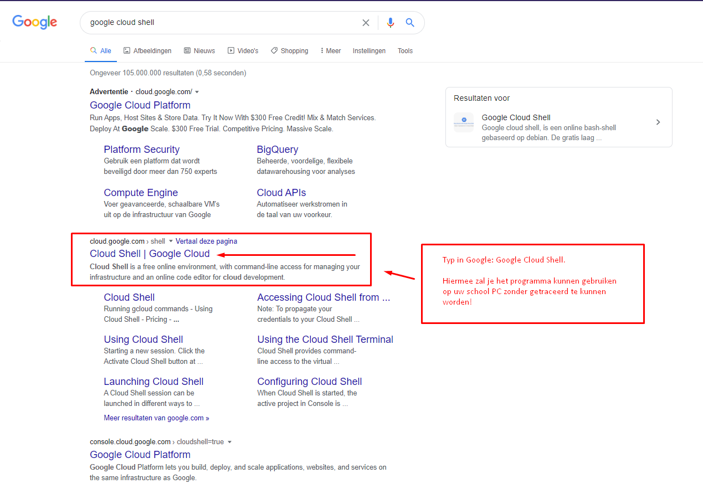
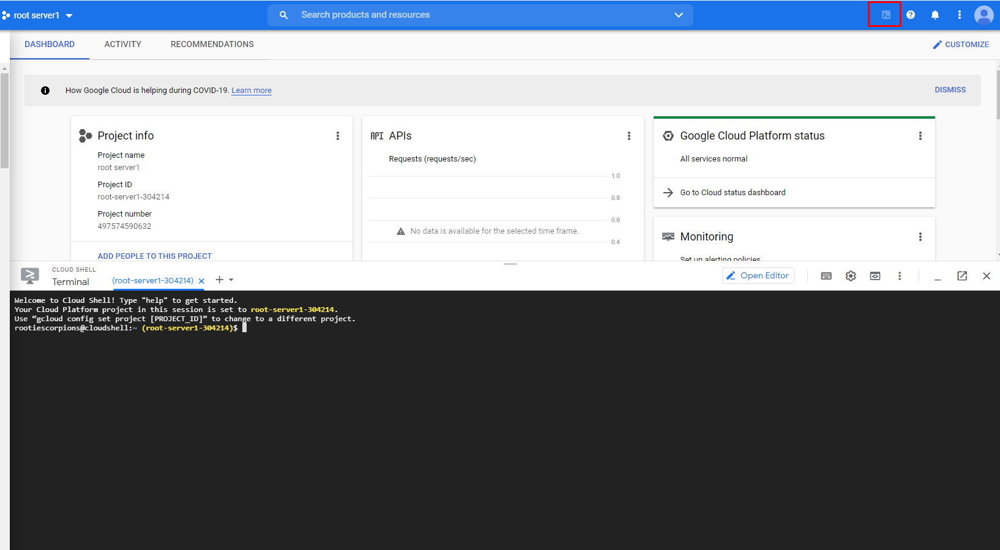

# KahootEqualsStraf
 
Verstuurd honderden BOTS in de door u gegevende Kahoot Code. Je zult je docenten hier zwaar mee kunnen irriteren!

# Installatie Instructies
 

 Ga in Google en type google cloud shell, en klik op de eerste pagina
 

 Je zult dit programma kunnen gebruiken op een school pc zonder iets te downloaden op je schoolcomputer! 
  En ze zullen je niet kunnen traceren!
 
  
  
  
 Klik op 'Go To Console'
 
  
  
  
 Log in met je google account of maak er snel 1 aan
 
  
  
  
 Er zal automatisch zo'n terminal zich openen. Als dat niet gebeurt klik rechts boven op dat knop die gemarkeerd is
  
  
  
 Kopieer en plak alle codes hieronder in uw terminal bij google cloud shell (let op: 1 voor 1!) :   <code>sudo apt update</code>   
  <code>sudo apt install git</code>  
  <code>git clone https://github.com/Z3NTL3/KahootEqualsStraf</code>  
  <code>cd KahootEqualsStraf</code>  
  <code>chmod +x kahootisstraf</code> 
  <code>./kahootisstraf</code> 

  
Eerst zal die alle benodigheden installeren. Waneer je ziet staan voer wachtwoord in typ de wachtwoord die ik hieronder aangegeven heb
 
  Wachtwoord van programma = Efdal
   
 Vervolgens klik je op enter en dan zal die Kahoot Code (Kahoot ID: ) vragen, voer het in en there you GO! :) Je docent zal de les sluiten xD
 
  
  
 Let OP: Tijdens installatie proces zal die soms om Y/N vragen dit houdt in: Zal ik het installeren ja of nee? Typ dan elke keer y en klik op enter!

  
